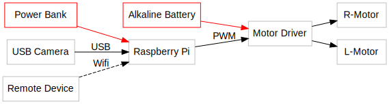

# TAMIYA-CAM-ROBOT

A ROS package to control [Tamiya's Cam-Program Robot](https://www.tamiya.com/english/products/70227/index.htm).

You can teleoperate the robot with web browser of your smart-phone.

## System structure




| Name | Role                                                                                   | 
|--------------------------------------|--------------------------------------------------------|
| Raspberry Pi | One board PC to control the cam-robot                                              |    
| USB Camera  |Camera to obtain robot's view                                                     |    
| Motor Driver |IC controlling DC motors. This repository uses [TB6612](https//www.switch-science.com/catalog/3586/)．                                 |  
| R/L-Motor |DC motors of the cam robot                                               |                                               
| Power Bank|  Battery for Raspberry Pi                                                    |                                            
| Alkaline Battery  |Battery for  the motors                                               |                                              
| Remote Device | Device to access the Pi.|                                                 

## Raspberry Pi OS Setup 

Please write Ubuntu image with ROS in a SD card for the Pi.
This project uses [Ubiquity Robotics' image](https://downloads.ubiquityrobotics.com/) (ROS Kinetic)．

## Wiring

TB6612 needs 2 digital input and 1 PWM input per motor. 

This project connects wires according to a following table and a figure.


| TB6612 | Other Device           |
|--------|------------------------|
| A_IN1  | Raspi-22               |
| A_IN2  | Raspi-27               |
| A_PWM  | Raspi-17               |
| B_IN1  | Raspi-13               |
| B_IN2  | Raspi-19               |
| B_PWM  | Raspi-26               |
| A01    | RMotor-YELLOW          |
| A02    | RMotor-BLUE            |
| B01    | LMotor-BLUE            |
| B02    | LMotor-YELLOW          |
| VM     | Alkaline-V+            |
| VCC    | Raspi-3V3              |
| STBY   | Raspi-3V3              |
| GND    | Raspi-GND, Alkaline-V- |


If you want to learn about TB6612, please read [a guide of SparkFun](https://learn.sparkfun.com/tutorials/tb6612fng-hookup-guide?_ga=2.166866110.1201478622.1514266488-1757053215.1500608008).

## Initial Setup and Motor Test

Before assembling the robot, please test ros and motor working. 
Please download this project in a catkin-workspace and build it. 

```bash
cd ~/catkin_ws/src
git clone git@gitlab.com:botamochi6277/tamiya_cam_robot.git
cd ~/catkin_ws
catkin_make
```

Please install [pigpio](http://abyz.me.uk/rpi/pigpio/) with following commands．

```bash
sudo apt-get update
sudo apt-get install pigpio python-pigpio python3-pigpio
```


We cannot generally run rosnode as root.
On the other hand, only root can control Pi GPIO.

When you run pigpiod, a demon controlling GPIO as root, ROS can controll GPIO via pigpiod. 

Please start pigpiod with following command. 

```bash
sudo pigpiod
```

Please read pin assignment.

```bash
cd ~/catkin_ws
rosparam load src/tamiya_cam_robot/pigpio.yaml
```

Drive the motors!

```bash
rosrun tamiya_cam_robot test_run
```


[pigpio.yaml](src/tamiya_cam_robot/pigpio.yaml) has a string array to define pin assignment.

## Assembling

Location and Orientation of components of the robot are not essential for working. 
Please design the location and orientation for your purpose. 

This project used a vertical stand and a neck extender which is made with a laser cutter.

## Obtain Camera Image with Web Browser

Please download and build ROS packages for web-communication and camera.

```bash
cd ~/catkin_ws/src
sudo apt-get install ros-kinetic-uvc-camera
sudo apt-get install ros-kinetic-roswww
sudo apt-get install ros-kinetic-rosbridge-suite
git clone https://github.com/RobotWebTools/web_video_server.git
git clone https://github.com/GT-RAIL/async_web_server_cpp.git
cd ../
catkin_make
```

Please run a node publishing a camera image.

```bash
rosrun uvc_camera uvc_camera_node
```

Please see list of topics with an other terminal.

```bash
rostopic list
```

You can get following topic list.

```
/camera_info
/image_raw
/image_raw/compressed
/image_raw/compressed/parameter_descriptions
/image_raw/compressed/parameter_updates
/image_raw/compressedDepth
/image_raw/compressedDepth/parameter_descriptions
/image_raw/compressedDepth/parameter_updates
/image_raw/theora
/image_raw/theora/parameter_descriptions
/image_raw/theora/parameter_updates
```

Please run a node to establish a server to watch the camera image.

```bash
rosrun web_video_server web_video_server
```

Plase access 
`http://[RaspberryPi's IP address]:8080/stream?topic=/image_raw` and watch the camera image. 

When you use the Pi directly (not ssh), you can watch in 
[http://localhost:8080/stream?topic=/image_raw](http://localhost:8080/stream?topic=/image_raw)．

## Teleoperation


Please run `teleop.launch`．

```
roslaunch tamiya_cam_robot teleop.launch
```

`teleop.launch` establishes a server for a teleoperation page.


Please access `http://[RaspberryPi's IP address]:8085/tamiya_cam_robot/teleop.html`．


<!-- rosrun turtlesim turtle_teleop_key /turtle1/cmd_vel:=/tamiya1/cmd_vel -->

