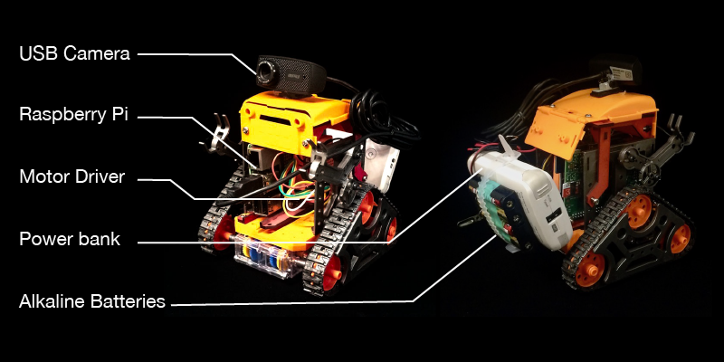
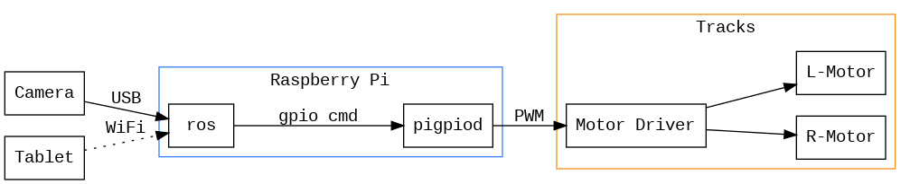
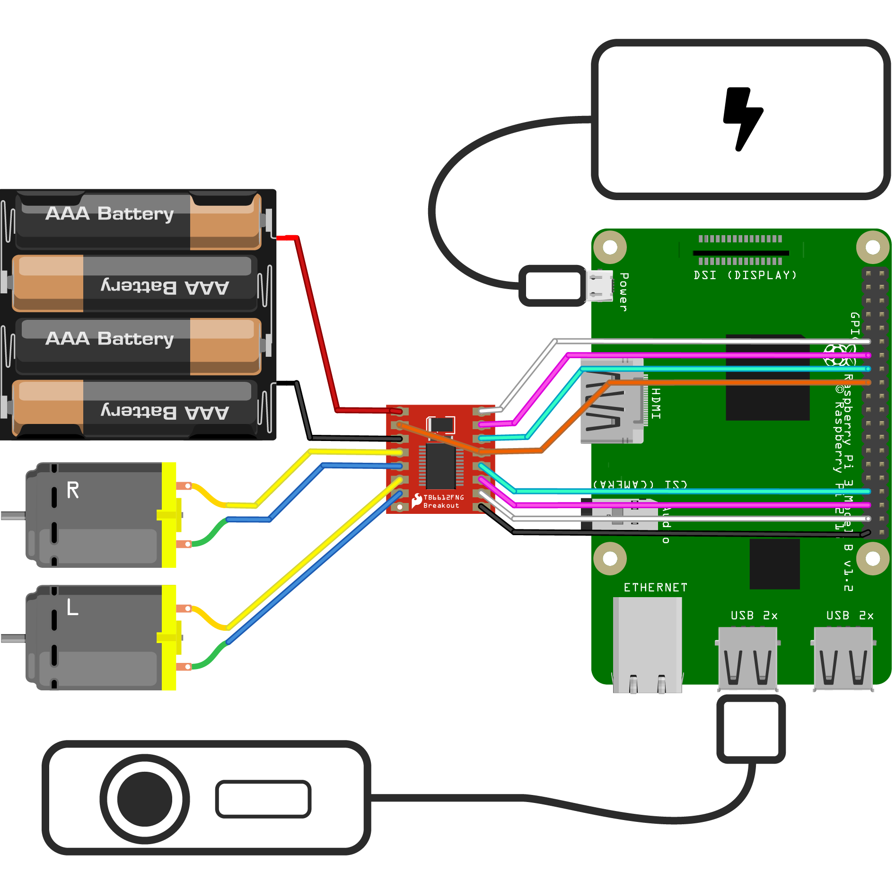

# TAMIYA-CAM-ROBOT

[タミヤのカムプログラミングロボット](https://tamiyashop.jp/shop/g/g70227/)を制御するためのROSパッケージ.

スマートフォンからブラウザを介して，カムロボットを操作することができます．
開発の際の細かな話はブログの方をお読みください．

## システムの構造





| 名称 | 説明                                                                                   | 
|--------------------------------------|--------------------------------------------------------|
| Raspberry Pi | ROSを搭載したメインコントローラ                                                |    
| USB Camera  |カムロボットに搭載するカメラ                                                     |    
| Motor Driver |DCモータを制御するためのIC．今回は[TB6612](https//www.switch-science.com/catalog/3586/)を使用．                                 |  
| R/L-Motor |カムロボットに搭載されているDCモータ                                               |                                               
| Power Bank|  Raspberry Pi 用のモバイルバッテリー                                                   |                                            
| Alkaline Battery  |モータ駆動用のアルカリ電池．                                               |                                              
| Remote Device |Wifiを通してRaspberry Piに接続する，リモコン用のデバイス(スマートフォンなど)． |                                                 

## Raspberry Pi OS Setup 

RaspberryPi用のSDカードにROSがインストール済みのUbuntuを書き込みます．
このプロジェクトでは
Ubiquity Roboticsさんが公開している[イメージファイル](https://downloads.ubiquityrobotics.com/)でテストしています．

## Motor Driver Setup

TB6612は1つのモータにつき，2つのデジタル入力と1つのPWMでの入力が必要となります. 
このプロジェクトにおいてはTB6612は他のデバイスと次のように接続されています．

| TB6612 | Other Device           |
|--------|------------------------|
| A_IN1  | Raspi-22               |
| A_IN2  | Raspi-27               |
| A_PWM  | Raspi-17               |
| B_IN1  | Raspi-13               |
| B_IN2  | Raspi-19               |
| B_PWM  | Raspi-26               |
| A01    | RMotor-YELLOW          |
| A02    | RMotor-BLUE            |
| B01    | LMotor-BLUE            |
| B02    | LMotor-YELLOW          |
| VM     | Alkaline-V+            |
| VCC    | Raspi-3V3              |
| STBY   | Raspi-3V3              |
| GND    | Raspi-GND, Alkaline-V- |



SparkFunさんが[TB6612についての詳しく説明してくれている](https://learn.sparkfun.com/tutorials/tb6612fng-hookup-guide?_ga=2.166866110.1201478622.1514266488-1757053215.1500608008)ので，詳しく知りたい人はこちらを参考にして下さい．

## Initial Setup  

RaspberryPiを起動し，本プロジェクトをcatkin_wsにダウンロードしビルドします．

```bash
cd ~/catkin_ws/src
git clone git@gitlab.com:botamochi6277/tamiya_cam_robot.git
cd ~/catkin_ws
catkin_make
```

続いて，GPIOを操作するために[pigpio](http://abyz.me.uk/rpi/pigpio/)というライブラリをインストールします，次のコマンドを実行してください．

```bash
sudo apt-get update
sudo apt-get install pigpio python-pigpio python3-pigpio
```

ROSは基本的にrootで実行できません．一方で，RaspberryPiのGPIOはrootでないと操作できません．
そこで，rootでpigpiodという[デーモン](https://ja.wikipedia.org/wiki/%E3%83%87%E3%83%BC%E3%83%A2%E3%83%B3_(%E3%82%BD%E3%83%95%E3%83%88%E3%82%A6%E3%82%A7%E3%82%A2))を立ち上げてRaspberryPiのGPIOの操作をお任せします．

```bash
sudo pigpiod
```

続いて，ピンの割り当てを読み込みます．

```bash
cd ~/catkin_ws
rosparam load src/tamiya_cam_robot/pigpio.yaml
```

続いて，モータを動かしていきます．

```bash
rosrun tamiya_cam_robot test_run
```

モータが正常に動いたら，ロボットを組み立てていきましょう．

## Obtain Camera Image with Web Brower

カメラ用のパッケージをダウンロードしてビルドします．

```bash
cd ~/catkin_ws/src
sudo apt-get install ros-kinetic-uvc-camera
git clone https://github.com/RobotWebTools/web_video_server.git
git clone https://github.com/GT-RAIL/async_web_server_cpp.git
cd ../
catkin_make
```

次にカメラ画像のトピックを飛ばします．

```bash
rosrun uvc_camera uvc_camera_node
```

別のターミナルを開いてトピックの一覧を見ます．

```bash
rostopic list
```

この時，次のようにトピック一覧が出てきます．

```
/camera_info
/image_raw
/image_raw/compressed
/image_raw/compressed/parameter_descriptions
/image_raw/compressed/parameter_updates
/image_raw/compressedDepth
/image_raw/compressedDepth/parameter_descriptions
/image_raw/compressedDepth/parameter_updates
/image_raw/theora
/image_raw/theora/parameter_descriptions
/image_raw/theora/parameter_updates
```

ここでは/image_rawをブラウザに表示させるために，配信サーバを立ち上げます．

```bash
rosrun web_video_server web_video_server
```

この状態で
`http://[RaspberryPiのIPアドレス]:8080/stream?topic=/image_raw`にブラウザでアクセスすると画像を確認できます．

RaspberryPiからは[http://localhost:8080/stream?topic=/image_raw](http://localhost:8080/stream?topic=/image_raw)からもアクセスできます．

http://ubiquityrobot.local:8085/tamiya_cam_robot/teleop_twist.html

## Teleoperation

`teleop.launch`を起動します．

```
roslaunch tamiya_cam_robot teleop.launch
```

`teleop.launch`はサーバーを立ち上げ，サーバーから配信されるコマンドを読み取りモータを動かすノードを立ち上げます．


この状態で`http://[RaspberryPiのIPアドレス]:8085/tamiya_cam_robot/teleop.html`にブラウザからアクセスします．

[http://ubiquityrobot.local:8085/tamiya_cam_robot/teleop.html](http://ubiquityrobot.local:8085/tamiya_cam_robot/teleop.html)からアクセスすることもできます．

